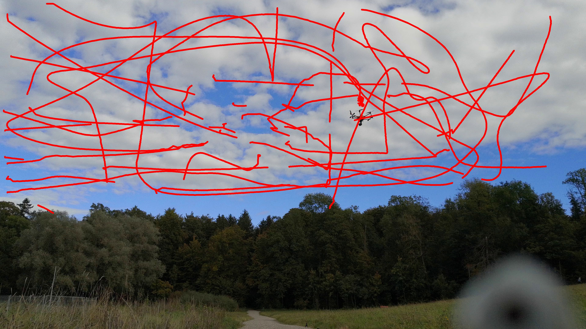

# Multi-view drone tracking datasets
This repository contains datasets where a flying drone (hexacopter) is captured with multiple consumer-grade cameras (smartphones, compact cameras, gopro,...) with highly accurate 3D drone trajectory ground truth recorderd by a precise real-time RTK system from [Fixposition](https://www.fixposition.ch). In some datasets, the ground truth temporal synchronization and ground truth camera locations are also provided. The table below gives a brief summary of what kind of data is available for each dataset.

| Dataset | 3D trajectory | Synchronization | Camera locations |
| --- | --- | --- | --- |
| 1 | Yes | No | No |
| 2 | Yes | No | No |
| 3 | Yes | Yes | Yes |
| 4 | Yes | Yes | No |

We provide calibration parameters as well as calibration images for each camera. Each dataset contains also 2D detections of the drone provided by a simple algorithm based on background subtraction.

This dataset was used in the experimental evaluation of [our paper](https://arxiv.org/abs/2003.04784) in which we estimate 3D trajectories from multiple unsynchronized cameras. The pipeline we developed can be found [here](https://github.com/CenekAlbl/mvus) .

# Installation
The videos have been split into multiple archives using zip. To extract, use 7z or other zip archive manager or run the provided script `./unpack.sh` from the repository root directory which will extract all videos for you, provided that you have 7z installed.

# Dataset 1
Easy dataset with short and slow flight.

| # of cameras | Flight duration | 
| --- | --- |
| 4 | ~ 2min |

# Dataset 2
Easy dataset with longer and faster flight.

| # of cameras | Flight duration | 
| --- | --- |
| 4 | ~ 2.5min |

# Dataset 3
Medium difficulty dataset with more cameras, long flight, various velocities and motion types.

| # of cameras | Flight duration | 
| --- | --- |
| 6 | ~ 9min |

# Dataset 4
High difficulty dataset with many cameras, fast motion and moving clouds making the detection harder.

| # of cameras | Flight duration | 
| --- | --- |
| 7 | ~ 7min |

# Authors
* **Cenek Albl** (cenek.albl-at-gmail.com) - *project lead*
* **Jingtong Li** (tong226-at-hotmail.com) - *data collection, GNSS, camera calibration*
* **Jesse Murray** (jesse.r.murray-at-gmail.com) - *data collection, camera calibration*
* **Chen-Chieh Liao** (liao86632769-at-gmail.com), **Dorina Ismalii** (dorinaismaili01-at-gmail.com ) - *2D trajectories*

# Acknowledgement
Special thanks to
* [Fixposition](https://www.fixposition.ch) for providing the drone and the RTK system 
* Alexander Wolf for the synchronization hardware
* Riccardo De Lutio, Tom Manu, Stefano D'Aronco, Mikhail Usvyatsov for helping with data collection
